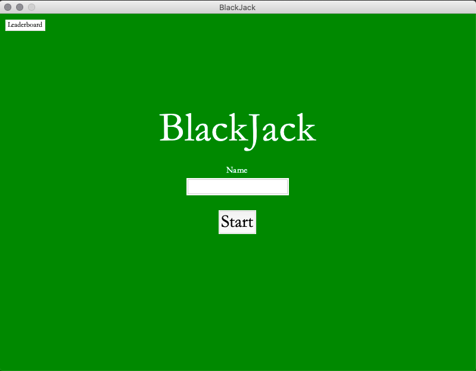
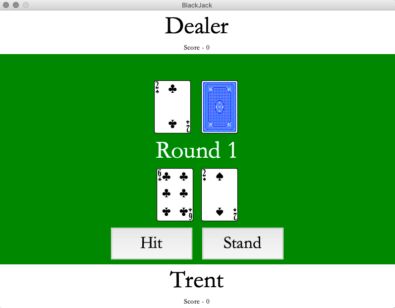
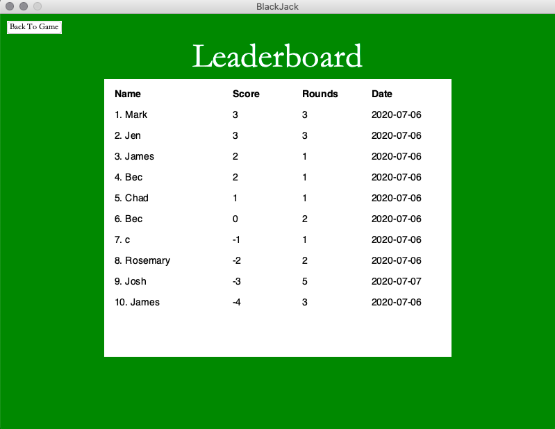

# BlackJack #

OOP BlackJack card game using tkinter, sqlite, and SVG cards. The game contains three main screens. The first is a title page:

The second is the game page:

The third is a leaderboard that displays the top 10 highest scores for your sqlite database:

*Beware that this game has been written and optimised for a Mac computer. The GUI on Windows will look different.*
