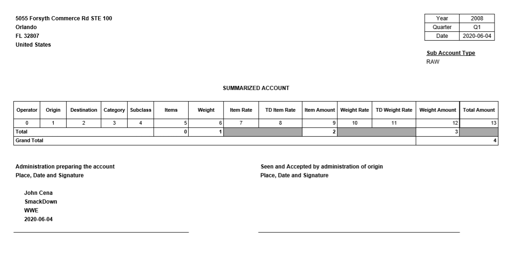
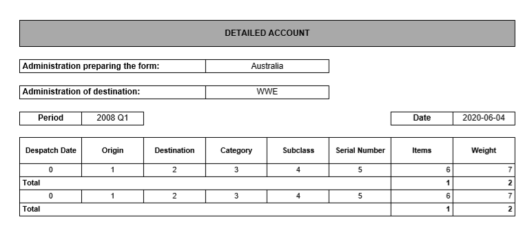
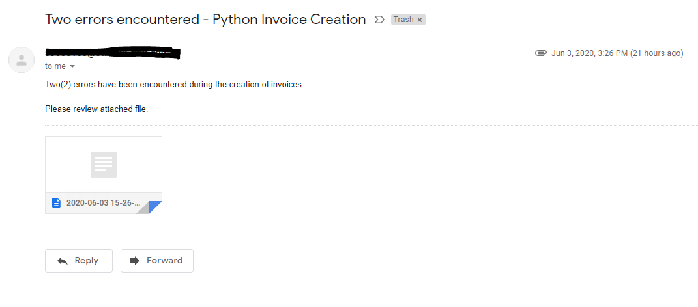
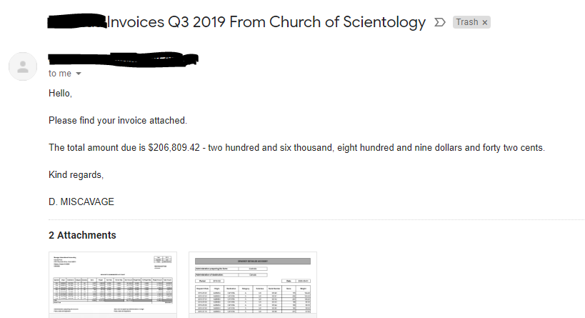

# Invoice Creation

This project is based on the same premise as my [VBA invoice creation process](https://github.com/chad-dickens/Stubbs/tree/master/Invoice%20Creation) in my Stubbs repository. The main difference (aside from being in Python) is that it does not have a user interface and is designed to be run on its own. The premise is that you have a large database and you need to create a large number of invoices from this data and email them to customers. The main module is invoice_creation.py, which imports from invoice_pdf_objects.py, email_module.py, and assorted_functions.py from the [assorted functions folder](https://github.com/chad-dickens/Sweet-Baby-Rays/tree/master/Assorted%20Functions). Below, I will provide an overview of the major elements of this process.


### Database

For this process I moved my data out of MS Access and into a MySQL Server. The creation of the three tables I needed is in db_setup.sql.

```
CREATE TABLE address_data (
ID int NOT NULL AUTO_INCREMENT, 
Country_Code CHAR(2),
Physical_Address VARCHAR(200),
Country_Name VARCHAR(50),
Email_Address VARCHAR(50),
PRIMARY KEY(ID));
```

However, the actual process of getting the data out of Access and into MySQL was giving me some grief, so I just exported the data into CSV files and used brute force with python to get it in, as per populating_sales_data.py.

```
import mysql.connector
import csv

file = 'MyFile.csv'

cnx = mysql.connector.connect(user='user', password='password',
                              host='host',
                              database='billings')

mycursor = cnx.cursor()

SQL = "INSERT INTO sales_data (Sub_Account_Type, Despatch_Year, Despatch_Month, Despatch_Date, " \
      "Qtr, Despatch_ID, Serial_Number, Origin, Destination, Mail_Category, Class, Subclass, " \
      "PL, Country_Office, Country_Code, No_of_ItRates, Weight_Kgs) " \
      "VALUES (%s, %s, %s, %s, %s, %s, %s, %s, %s, %s, %s, %s, %s, %s, %s, %s, %s);"

with open(file) as my_file:
    reader = csv.reader(my_file)

    for row in reader:

        for i in [1, 2, 4, 6, 15]:
            row[i] = int(row[i])

        row[-1] = float(row[-1])

        mycursor.execute(SQL, tuple(row))

cnx.commit()

cnx.close()
```


### PDFs

For the creation of my PDFs I used the PyFPDF library and I created a class for each of my two invoices in the invoice_pdf_objects.py module. I actually preferred creating PDFs using this library as opposed to using Excel. I felt as though I had more control over how the document looked, it was very easy to use, and it looked better visually. Perhaps it would be a different story if my document was more complicated, but for invoices I thought it was a good match.

An example of my PyFPDF summary invoice:


An example of my PyFPDF detail invoice:



### Error Logging

Given that this was going to be an automated process with no human intervention, I placed priority on carfully documenting what happened. This was in part facilitated by the send_email_365() function in the email_module.py file which makes use of broad exception clauses to catch errors and return them, such as:
```
except Exception as err:
        return (False, '{}\nUnable to send email to {}.\n'
                'Error Description: {}.\n'.format(time_stamp, email_recipient, err))

    # Confirming if successful
    else:
        return (True, '{}\nEmail sent successfully to recipient {} with attachments {}.\n'
                .format(time_stamp, email_recipient, attachments))
                
```

Using the log_status() method in the customers class in the invoice_creation.py file, the outcome for each customer was logged in a full log txt file, and if an error had occurred, it was logged in an additional error log txt file. The log file looked like so:

```
1. RK
2020-06-03 21:22:43 AUS Eastern Standard Time
Email sent successfully to recipient customeremail@gmail.com with attachments ('Attachment1.pdf', 'Attachment2.pdf').

2. TA
No files created and no emails sent.

2 rate(s) issues were found:
	1. 2019HJLDSAF
	2. 2019FDAFHFS

Customer address issue(s) found.
	Name: None
	Address: None
	Email: None

====================================================================================================

ELAPSED TIME (Hours, Mins, Secs): 00:00:18.
```

Furthermore, if errors have occurred, an email will be sent to the process manager like so:




### Customer Email

An example of my email to customers is below:


You'll notice that in both the email to customers and the error log email to the process manager, I utilisied by number_name() function from the assorted_functions.py file. While perhaps a little unnecessary, I thought this was a good practical use of that function.
